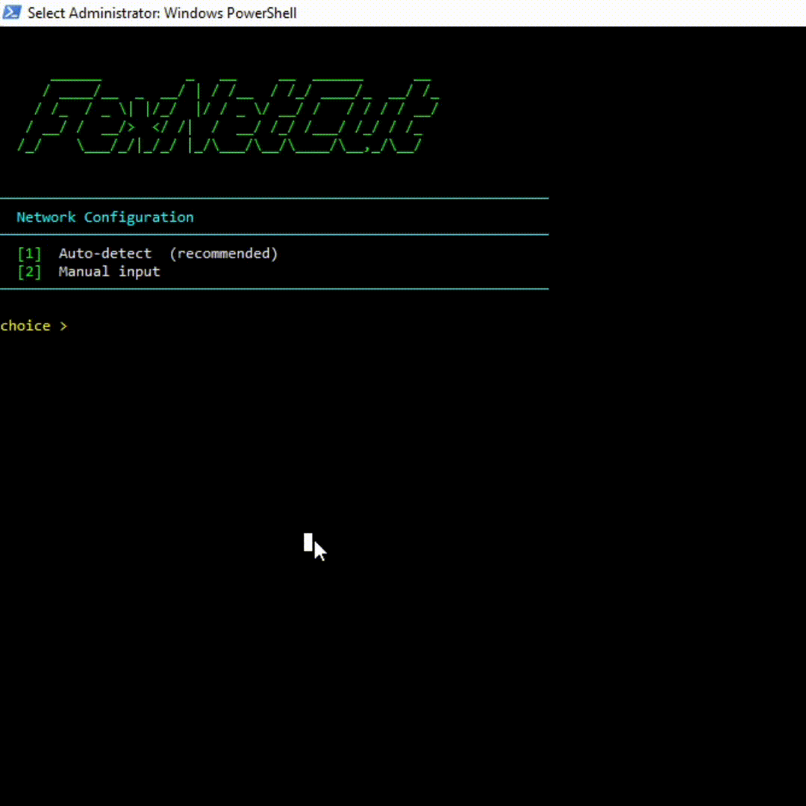

<div align="center">
  <h1>FexCutNet</h1>
  
</div>

> A lightweight network discovery and diagnostics tool built with Python and Scapy. It helps administrators identify active hosts on a local network and inspect basic service availability for inventory and troubleshooting purposes.

---

##  Features

* Fast ARP-based subnet discovery
* Live host identification
* Multi-threaded TCP port checks
* Simple console interface
* Detailed scan results
* Cross-platform support (Windows/Linux)

---

##  Requirements

* Python 3.10+
* Administrator / Root privileges
* Scapy

---

##  Installation

### Clone Repository

```bash
git clone https://github.com/Dsevenfex/FexNetCut.git
cd FexNetCut
```

### Install Dependencies

``` bash
python3 -m venv venv
```
##### Linux && Mac
```bash
source venv/bin/activate

pip install scapy
```
##### Windows
```bash
venv\Scripts\activate

pip install scapy
```


---

##  Usage

### Linux

```bash
sudo python FexNetCut.py
```

### Windows

Run PowerShell or Command Prompt as Administrator:

```bash
python FexNetCut.py
```


---

##  Scan Process

1. Discover active devices on the subnet.
2. Collect IP and MAC addresses.
3. Check selected TCP ports.
4. Display results in a structured table.

---

##  Disclaimer

This software is intended for network administration, troubleshooting, education, and authorized security testing on systems you own or have permission to assess.

